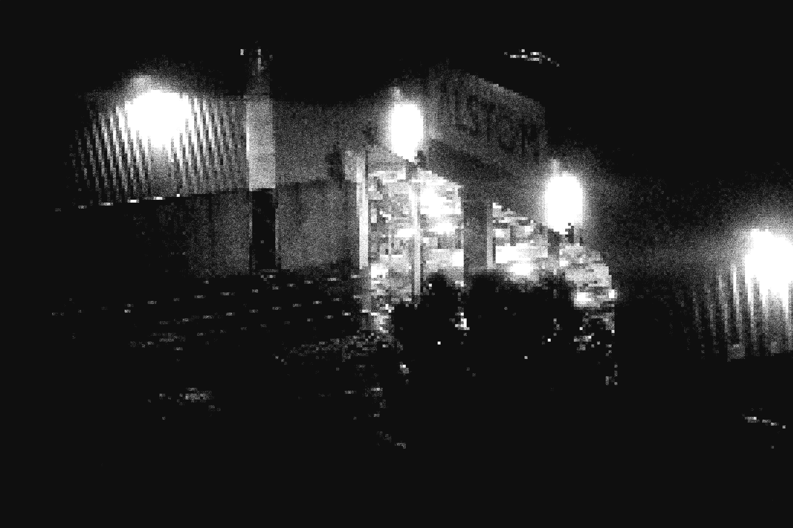

# ImageFilter

A program that applies OpenGL compute shaders to images.

Compiled windows binaries at [latest release](https://github.com/jiamingwangnet/ImageFilter/releases/tag/v1.0.0).

Targets OpenGL 4.6.

